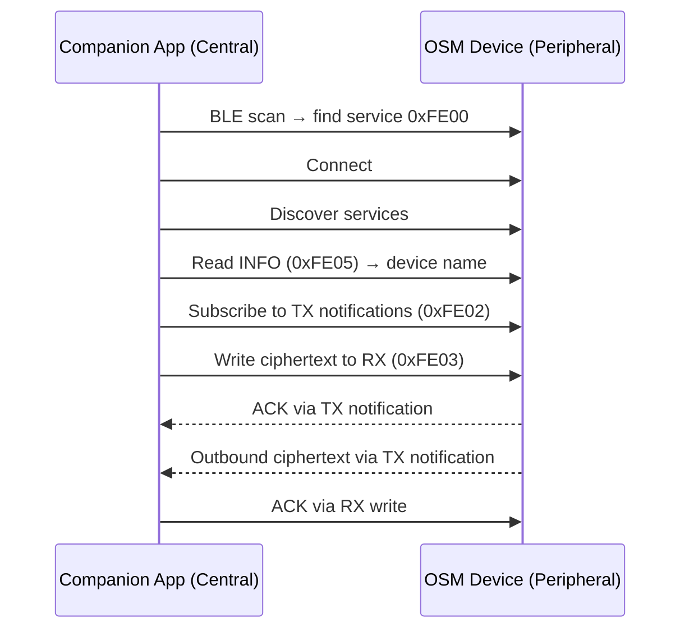

# AGENTS.md — AI Context for Offline Secure Messenger

This file provides context for AI coding assistants working on this repository.

## Repository Overview

Two-component secure messaging system:
- **OSM** — C firmware (LVGL 9.4 + SDL2 desktop simulator, target: ESP32-S3)
- **Companion App (CA)** — Kotlin Multiplatform (desktop JVM + Android)

Plaintext never leaves the OSM. The CA only handles ciphertext.

## BLE Transport Architecture

The OSM acts as a **BLE GATT server** (peripheral). The CA acts as a **GATT
client** (central). This mirrors the hardware target (LILYGO T-Deck with
BLE 5.0) where the phone initiates connections to the OSM device.



### GATT Service Definition

| UUID | Name | Properties | Direction | Description |
|------|------|------------|-----------|-------------|
| `0000fe00-…` | Service | — | — | Custom OSM service |
| `0000fe02-…` | TX | Notify | OSM → CA | Outbound ciphertext + ACKs |
| `0000fe03-…` | RX | Write Without Response | CA → OSM | Inbound ciphertext + ACKs |
| `0000fe04-…` | STATUS | Read | OSM → CA | Connection status (reserved) |
| `0000fe05-…` | INFO | Read | OSM → CA | Device name string |

Full 128-bit UUIDs use the Bluetooth SIG base: `0000XXXX-0000-1000-8000-00805f9b34fb`

### Fragmentation Protocol

Messages are fragmented to fit BLE MTU (200 bytes). Wire format per fragment
(little-endian):

```
[flags:1][seq:2][total_len:2 (START only)][payload:N]
```

Flags: `START=0x01`, `END=0x02`, `ACK=0x04`. ACK msg_id = first 8 bytes of
SHA-512 of the reassembled payload (TweetNaCl's `crypto_hash`).

## Transport Source Structure

```
osm/src/transport/
├── transport.h          # Public API + constants (MTU, UUIDs, flags)
├── transport_common.c   # Shared logic: fragmentation, reassembly, ACK, broadcast
├── transport_tcp.c      # TCP backend (desktop simulator, OSM listens on port)
└── transport_ble.c      # BLE backend (BlueZ GATT server via D-Bus/libdbus-1)
```

Only one backend is compiled at a time — controlled by `TRANSPORT_BLE` CMake
option. `transport_common.c` is always included.

## Building

### OSM — TCP (desktop simulator, default)

```bash
cd osm && mkdir -p build && cd build
cmake .. && make -j$(nproc)
./secure_communicator                 # interactive (port 19200)
./secure_communicator --test          # run 69 built-in tests
./secure_communicator --port 19201 --name Bob
```

### OSM — BLE (BlueZ GATT server)

Requires `libdbus-1-dev` and a BlueZ-managed BLE adapter.

```bash
cd osm && mkdir -p build_ble && cd build_ble
cmake .. -DTRANSPORT_BLE=ON && make -j$(nproc)
sudo ./secure_communicator            # needs root for BlueZ D-Bus
```

### Desktop Companion App

```bash
cd companion-app
./gradlew :desktopApp:run
```

### Android Companion App

Requires Android SDK (API 34+), JDK 17+.

```bash
cd companion-app
./gradlew :androidApp:assembleDebug
# Install via adb install androidApp/build/outputs/apk/debug/*.apk
```

## Running Tests

### OSM built-in tests

```bash
cd osm/build && ./secure_communicator --test
```

69 automated tests: screens, navigation, input, CRUD, crypto, transport.

### E2E integration tests (TCP transport)

```bash
cd osm/build && cmake .. && make -j$(nproc)
cd ../..
SDL_VIDEODRIVER=dummy python3 -m pytest tests/e2e_test.py -v
```

43 tests: full KEX flows, encrypted messaging, outbox persistence, reconnection,
adversarial scenarios (disconnect, restart, overflow, corrupt fragments).

Requires: `pytest`, `pynacl` (`pip install pytest pynacl`).

### Clearing persistent data

```bash
rm osm_data.img          # from repo root (or wherever OSM runs)
rm /tmp/osm_*/osm_data.img  # test temp dirs (auto-cleaned)
```

### BLE integration tests

Requires a BLE adapter and an OSM running with BLE transport.

```bash
# Terminal 1: start OSM with BLE
cd osm/build_ble && sudo ./secure_communicator

# Terminal 2: run BLE tests
uv run pytest tests/ble_integration_test.py -v -s
```

Tests skip gracefully if no BLE adapter is available.

## Stdin Command Protocol (Desktop/Test Only)

The OSM process reads newline-delimited commands from stdin (guarded by
`#ifndef OSM_MCU_BUILD`). Commands prefixed with `CMD:` drive the app
programmatically; responses go to stdout prefixed with `CMD:`.

### Data Commands

| Command | Description |
|---------|-------------|
| `CMD:STATE` | Dump contacts, messages, pending keys, outbox |
| `CMD:KEYGEN` | Generate new identity keypair |
| `CMD:IDENTITY` | Print pubkey (base64) |
| `CMD:PRIVKEY` | Print privkey (base64) |
| `CMD:SET_IDENTITY:<pub>:<priv>` | Set identity from base64 keypair |
| `CMD:ADD:<name>` | Add contact (PENDING_SENT status) |
| `CMD:ADD_CONTACT:<name>:<status>:<pubkey>` | Add contact with explicit status/key |
| `CMD:ASSIGN:<name>` | Assign oldest pending key to contact |
| `CMD:CREATE:<name>` | Create contact from pending key |
| `CMD:COMPLETE:<name>` | Complete KEX for PENDING_RECEIVED contact |
| `CMD:SEND:<name>:<text>` | Send message to established contact |
| `CMD:RECV_COUNT:<n>` | Simulate receiving n incoming messages |
| `CMD:DELETE:<name>` | Delete contact and their messages |
| `CMD:DELETE_MSG:<text>` | Delete first message matching text |

### UI-Driven Commands

| Command | Description |
|---------|-------------|
| `CMD:UI_ADD_CONTACT:<name>` | Simulate adding contact via UI |
| `CMD:UI_COMPOSE:<name>:<text>` | Simulate composing+sending via UI |
| `CMD:UI_REPLY:<name>:<text>` | Reply via conversation screen |
| `CMD:UI_OPEN_CHAT:<name>` | Open conversation screen for contact |
| `CMD:UI_ASSIGN_PENDING:<name>` | Assign pending key via UI flow |
| `CMD:UI_NEW_FROM_PENDING:<name>` | Create new contact from pending key via UI |
| `CMD:UI_COMPLETE_KEX:<name>` | Complete KEX via conversation screen |

## Security Hardening

- **Private key zeroing:** `secure_zero()` (volatile memset) zeros privkey on shutdown
- **Buffer zeroing:** All intermediate base64 and crypto work buffers zeroed before free
- **RNG self-test:** Reads 32 bytes at startup, verifies not all-zero
- **Storage error detection:** `hal_storage_write_file()` returns LFS error codes;
  NOSPC sets `g_app.storage_full` (red "FULL" indicator), other errors set
  `g_app.storage_error` (orange "⚠ STOR" indicator)
- **Parse corruption warnings:** All load functions log a warning if the file contains
  data but 0 items were parsed
- **Transport validation:** START frame `total_len` validated against `TRANSPORT_MAX_MSG_SIZE`
- **Crypto stack buffers:** No heap allocation in encrypt/decrypt (bounded stack buffers)

## Key Conventions

- C11, LVGL 9.4 API, TweetNaCl for crypto
- PEP 723 inline metadata for Python test scripts (`uv run` compatible)
- **Persistent storage**: All data lives inside a LittleFS filesystem image
  (`osm_data.img`). Delete the file to reset all state.
- Files stored in LittleFS: `contacts.json`, `identity.json`, `messages.json`,
  `pending_keys.json`, `outbox.json`
- Desktop-only code guarded by `#ifndef OSM_MCU_BUILD`
- OSM default TCP port: 19200 (scan range 19200–19209)

## HAL (Platform Abstraction Layer)

The OSM firmware is portable between desktop (SDL2) and MCU (ESP32-S3) via HAL
modules in `osm/src/hal/`:

| Module | Header | Desktop Impl | Purpose |
|--------|--------|-------------|---------|
| Storage | `hal_storage.h` | `hal_storage_filebd.c` | LittleFS init/mount/get (file-backed block device) |
| RNG | `hal_rng.h` | `hal_rng_posix.c` | Random bytes (`/dev/urandom`) |
| Log | `hal_log.h` | `hal_log_posix.c` | `fprintf(stderr, ...)` |
| Time | `hal_time.h` | `hal_time_posix.c` | Monotonic clock + delay (`clock_gettime`/`usleep`) |

Helper: `hal_storage_util.h` — inline `hal_storage_read_file()` / `hal_storage_write_file()`
wrapping LittleFS open/read/write/close into single calls.

### LittleFS Configuration (Desktop)

- Block size: 4096, Block count: 256 (1 MB virtual flash)
- Backing file: `osm_data.img` in working directory
- Auto-formats on first use (mount fails → format → mount)

## MCU RAM Footprint (Critical)

`app_state_t` (`g_app`) is the main application struct. Current RAM usage:

| Field | Size |
|-------|------|
| `messages[256]` (256 × 3092 B) | **791 KB** |
| `outbox[32]` (32 × 2060 B) | **66 KB** |
| `contacts[32]` (32 × 340 B) | **11 KB** |
| `pending_keys[8]` (8 × 264 B) | **2 KB** |
| Other fields | ~1 KB |
| **Total** | **~871 KB** |

**Problem:** ESP32-S3 has 512 KB SRAM (320 KB usable after LVGL framebuffers).
The `messages[]` array alone exceeds available RAM.

**Migration plan for MCU:**
1. Reduce `MAX_MESSAGES` from 256 → 64 (~194 KB savings)
2. Move `ciphertext[2048]` out of `message_t` into LittleFS (per-message files)
   — reduces `message_t` from 3092 B to ~1044 B (~67 KB for 64 messages)
3. Store only the most recent N messages in RAM; page older ones from flash
4. Consider reducing `MAX_CIPHER_LEN` if protocol permits shorter payloads
