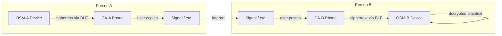

# Offline Secure Messenger

A secure offline messaging system with two components:

1. **OSM** (Offline Secure Messenger) — a microcontroller-based device with a
   320×240 display and BlackBerry-style keyboard. Handles all encryption,
   decryption, and key management. Plaintext never leaves this device.
2. **Companion App** (CA) — an Android/desktop app that bridges encrypted
   ciphertext between the OSM and the user's regular messaging apps via BLE.

The host device (phone/PC) is treated as a compromised communications pipe —
it only ever sees ciphertext.

## Architecture



## Repository Structure

```
offline-secure-messenger/
├── osm/                    # OSM device firmware + desktop simulator
│   ├── CMakeLists.txt
│   ├── lv_conf.h
│   ├── lvgl/               # LVGL 9.4 (git submodule)
│   ├── src/                # C source — LVGL UI, data layer, crypto
│   └── tests/
├── companion-app/          # Companion App (planned — Kotlin Multiplatform)
├── tests/                  # E2E integration tests (planned)
├── LICENSE
└── README.md               # This file
```

## Components

### OSM (Offline Secure Messenger)

Desktop simulator built with C + LVGL 9.4 + SDL2. See [`osm/README.md`](osm/README.md)
for build instructions, screen descriptions, and technical details.

**Target hardware**: LILYGO T-Deck (ESP32-S3, 320×240, BLE 5.0, QWERTY keyboard)

### Companion App (planned)

Kotlin Multiplatform + Compose Multiplatform targeting Android and desktop.
Communicates with the OSM over BLE (TCP localhost for desktop simulation).

## Quick Start

```bash
# Clone with submodules
git clone --recurse-submodules <repo-url>
cd offline-secure-messenger

# Build and run OSM simulator
cd osm
mkdir -p build && cd build
cmake .. && make -j$(nproc)
./secure_communicator        # Interactive mode
./secure_communicator --test # Automated tests (50 tests)
```

## Prerequisites

| Dependency | Version | Notes |
|---|---|---|
| GCC or Clang | C11 | Any modern version |
| CMake | ≥ 3.16 | Build system |
| SDL2 | ≥ 2.0 | `libsdl2-dev` on Debian/Ubuntu |
| pkg-config | any | Used by CMake to find SDL2 |
| Git | any | For submodules |

```bash
sudo apt-get install build-essential cmake libsdl2-dev pkg-config git
```

## License

This work is licensed under the
[Creative Commons Attribution-NonCommercial-ShareAlike 4.0 International License](https://creativecommons.org/licenses/by-nc-sa/4.0/).
See [LICENSE](LICENSE) for the full text.
