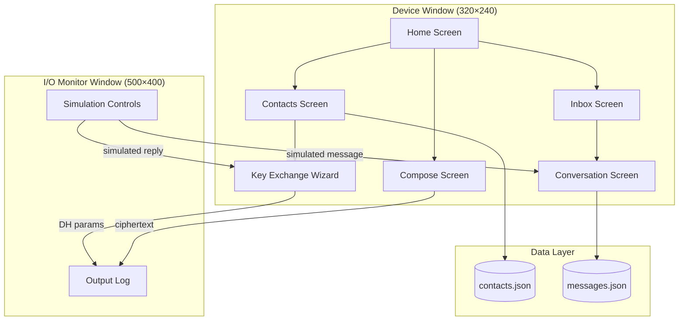
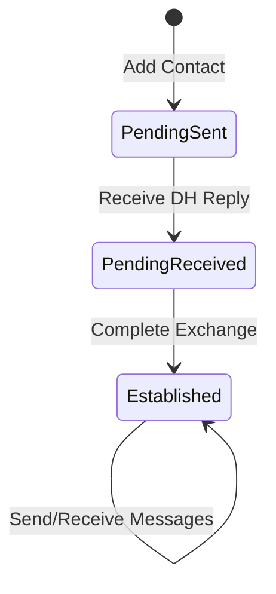

# Secure Communicator — UI Prototype

A desktop simulator for a hardware secure-messaging device. The real device
uses a microcontroller with a 320×240 display and a BlackBerry-style keyboard
with a trackball. This prototype recreates the UI using **LVGL 9.4** on
**SDL2** so the interaction design can be iterated on a PC before targeting
hardware.

The device encrypts messages and acts as a USB/Bluetooth keyboard to type
ciphertext on an untrusted host (phone or PC). The host never sees plaintext.
No real cryptography is implemented here — this is purely a UI/UX prototype.

## Architecture



### Screens

| Screen | Purpose |
|---|---|
| **Home** | Dashboard with contact list, status icons, unread badges, and navigation |
| **Contacts** | Add/view contacts, tap a contact to start key exchange |
| **Key Exchange** | 3-step Diffie-Hellman wizard (send params → receive reply → establish) |
| **Compose** | Pick an established contact, type a message, send (outputs ciphertext) |
| **Inbox** | Conversation list sorted by most-recent message |
| **Conversation** | Chat bubbles with inline reply |

### I/O Monitor (second window)

A separate SDL window that shows what the device would output to the
untrusted host, and provides simulation controls:

- **Output log** — timestamped entries for DH parameters and ciphertext
- **DH Reply buttons** — simulate receiving a Diffie-Hellman reply for pending contacts
- **Incoming message injection** — pick a contact, type a message, inject it
- **New contact simulation** — create a contact initiated from the remote side

### Contact Lifecycle



## Prerequisites

| Dependency | Version | Notes |
|---|---|---|
| GCC or Clang | C11 support | Any modern version |
| CMake | ≥ 3.16 | Build system |
| SDL2 | ≥ 2.0 | `libsdl2-dev` on Debian/Ubuntu |
| pkg-config | any | Used by CMake to find SDL2 |
| Git | any | For the LVGL submodule |

**Debian/Ubuntu one-liner:**

```bash
sudo apt-get install build-essential cmake libsdl2-dev pkg-config git
```

LVGL 9.4.0 is included as a git submodule — no separate installation needed.

## Building

```bash
# Clone (with submodule)
git clone --recurse-submodules <repo-url>
cd secure-communicator

# If you already cloned without submodules:
git submodule update --init --recursive

# Build
mkdir -p build && cd build
cmake ..
make -j$(nproc)
```

The binary is produced at `build/secure_communicator`.

## Running

### Interactive mode

```bash
cd build
./secure_communicator
```

Two SDL windows open:

1. **Secure Communicator** (640×480 — the 320×240 device display at 2× zoom)
2. **I/O Monitor** (500×400 — simulation and output log)

Use mouse and keyboard in both windows. Click textareas to focus them before
typing.

### Self-test mode

```bash
cd build
./secure_communicator --test
```

Runs 40 automated tests covering all screens, navigation flows, button
interactions, textarea input, and group management. Screenshots are saved to
`screenshots/` as BMP files. The process exits with code 0 on success.

### Smoke test (Python)

```bash
cd build
python3 ../tests/smoke_test.py
```

Runs the built-in test mode and validates output + screenshot integrity.

## Project Structure

```
secure-communicator/
├── CMakeLists.txt          # Build configuration
├── lv_conf.h               # LVGL compile-time settings
├── lvgl/                   # LVGL 9.4.0 (git submodule)
├── src/
│   ├── main.c              # Entry point, dual-display + input setup
│   ├── app.h               # Types, constants, app state struct
│   ├── app.c               # App lifecycle, navigation, test driver
│   ├── crypto_sim.h/c      # Fake encrypt/decrypt/DH (placeholder)
│   ├── io_monitor.h/c      # Second SDL window (output log + sim controls)
│   ├── data/
│   │   ├── contacts.h/c    # Contact CRUD + JSON persistence
│   │   └── messages.h/c    # Message CRUD + JSON persistence
│   └── screens/
│       ├── scr_home.h/c        # Home dashboard
│       ├── scr_contacts.h/c    # Contact management
│       ├── scr_key_exchange.h/c # DH key exchange wizard
│       ├── scr_compose.h/c     # Message composition
│       ├── scr_inbox.h/c       # Conversation list
│       └── scr_conversation.h/c # Chat view
├── tests/
│   └── smoke_test.py       # Automated validation script
├── data_contacts.json      # Persisted contacts (created at runtime)
└── data_messages.json      # Persisted messages (created at runtime)
```

## Key Technical Decisions

- **LVGL 9.4 + SDL2**: LVGL's built-in SDL driver renders the UI. Two
  `lv_display_t` instances drive two SDL windows. Each display has its own
  mouse and keyboard input devices.
- **Manual input group management**: `lv_group_set_default()` is intentionally
  avoided because it auto-adds widgets from all displays into one group,
  causing cross-display focus issues. Textareas are explicitly added to the
  correct group (`dev_group` or `io_group`).
- **Display–indev binding**: `lv_indev_create()` binds to whichever display is
  default at creation time. The code carefully sets the correct default before
  creating each window's input devices.
- **C11, no external deps beyond SDL2**: Keeps the path to microcontroller
  deployment short. JSON persistence is hand-rolled (no cJSON).
- **2× SDL zoom**: The 320×240 device display is rendered at 640×480 for
  comfortable desktop use.
- **Dark theme**: Configured via `lv_theme_default_init()` with a colour
  palette designed for small embedded displays.

## Configuration

`lv_conf.h` controls LVGL's compile-time settings. Key values:

| Setting | Value | Purpose |
|---|---|---|
| `LV_COLOR_DEPTH` | 16 | Match typical embedded LCD panels |
| `LV_MEM_SIZE` | 128 KB | LVGL memory pool |
| `LV_FONT_MONTSERRAT_*` | 10, 12, 14, 16 | Available font sizes |
| `LV_FONT_DEFAULT` | Montserrat 12 | Default UI font |
| `LV_USE_SDL` | 1 | Enable SDL2 display/input drivers |
| `LV_SDL_DIRECT_EXIT` | 1 | `exit(0)` on SDL window close |

## License

This work is licensed under the
[Creative Commons Attribution-NonCommercial-ShareAlike 4.0 International License](https://creativecommons.org/licenses/by-nc-sa/4.0/).
See [LICENSE](LICENSE) for the full text.
