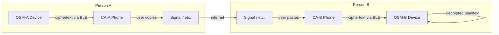

# Offline Secure Messenger

A secure offline messaging system with two components:

1. **OSM** (Offline Secure Messenger) — a microcontroller-based device with a
   320×240 display and BlackBerry-style keyboard. Handles all encryption,
   decryption, and key management. Plaintext never leaves this device.
2. **Companion App** (CA) — an Android/desktop app that bridges encrypted
   ciphertext between the OSM and the user's regular messaging apps via BLE.

The host device (phone/PC) is treated as a compromised communications pipe —
it only ever sees ciphertext.

## Architecture



## Repository Structure

```
offline-secure-messenger/
├── osm/                    # OSM device firmware + desktop simulator
│   ├── CMakeLists.txt
│   ├── lv_conf.h
│   ├── lvgl/               # LVGL 9.4 (git submodule)
│   ├── src/                # C source — LVGL UI, data, crypto, transport
│   └── tests/
├── companion-app/          # Companion App (Kotlin Multiplatform + Compose)
│   ├── shared/             # Common code (model, transport, UI)
│   └── desktopApp/         # Desktop entry point
├── tests/                  # Integration tests (E2E TCP + BLE)
├── AGENTS.md               # AI assistant context (architecture, build, test)
├── LICENSE
└── README.md               # This file
```

## Components

### OSM (Offline Secure Messenger)

Desktop simulator built with C + LVGL 9.4 + SDL2. See [`osm/README.md`](osm/README.md)
for build instructions, screen descriptions, and technical details.

**Target hardware**: LILYGO T-Deck (ESP32-S3, 320×240, BLE 5.0, QWERTY keyboard)

### Companion App

Kotlin Multiplatform + Compose Multiplatform targeting Android and desktop.
Communicates with the OSM over TCP (desktop simulation) or BLE (Android).
See [`companion-app/README.md`](companion-app/README.md) for details.

## Build Targets

| Target | Transport | Build Command | Notes |
|--------|-----------|---------------|-------|
| **OSM (TCP)** | TCP socket | `cmake .. && make` | Desktop simulator (default) |
| **OSM (BLE)** | BlueZ GATT | `cmake .. -DTRANSPORT_BLE=ON && make` | Requires `libdbus-1-dev`, root for BlueZ |
| **Desktop CA** | TCP | `./gradlew :desktopApp:run` | JDK 11+, auto-discovers OSMs |
| **Android CA** | BLE | `./gradlew :androidApp:assembleDebug` | Android SDK API 34+, JDK 17+ |

### BLE Transport

In BLE mode the OSM runs as a GATT server (peripheral) advertising service
UUID `0000fe00-0000-1000-8000-00805f9b34fb`. The CA connects as a GATT client
and exchanges ciphertext fragments via the TX (notify, `0xFE02`) and RX
(write, `0xFE03`) characteristics. An INFO characteristic (`0xFE05`) provides
the device name. Messages are fragmented to fit the BLE MTU (200 bytes).

## Quick Start

```bash
# Clone with submodules
git clone --recurse-submodules <repo-url>
cd offline-secure-messenger

# Build and run OSM simulator (TCP, default)
cd osm
mkdir -p build && cd build
cmake .. && make -j$(nproc)
./secure_communicator              # Interactive mode (port 19200)
./secure_communicator --test       # Automated tests (69 tests)

# Build OSM with BLE transport (optional)
mkdir -p ../build_ble && cd ../build_ble
cmake .. -DTRANSPORT_BLE=ON && make -j$(nproc)
sudo ./secure_communicator         # Needs root for BlueZ D-Bus

# In another terminal — build and run Companion App
cd companion-app
./gradlew :desktopApp:run
```

## Prerequisites

| Dependency | Version | Notes |
|---|---|---|
| GCC or Clang | C11 | OSM build |
| CMake | ≥ 3.16 | OSM build system |
| SDL2 | ≥ 2.0 | `libsdl2-dev` on Debian/Ubuntu |
| JDK | ≥ 11 | Companion App (JDK 17+ for packaging) |
| pkg-config | any | Used by CMake to find SDL2 |
| Git | any | For submodules |

```bash
sudo apt-get install build-essential cmake libsdl2-dev pkg-config git openjdk-17-jdk
```

## License

This work is licensed under the
[Creative Commons Attribution-NonCommercial-ShareAlike 4.0 International License](https://creativecommons.org/licenses/by-nc-sa/4.0/).
See [LICENSE](LICENSE) for the full text.
