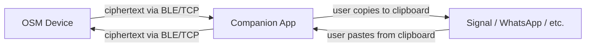

# Companion App (CA)

Desktop/Android companion app for the Offline Secure Messenger (OSM).
Acts as a **clipboard bridge** — receives encrypted ciphertext from the OSM
over BLE (or TCP in simulator mode) and displays it for the user to copy
into their messaging app. Incoming ciphertext from messaging apps is pasted
into the CA and sent to the OSM for decryption.

## Architecture



## Tech Stack

- **Kotlin Multiplatform** + **Compose Multiplatform**
- Desktop (JVM) + Android targets
- TCP transport for desktop simulator, BLE for Android (future)

## Building & Running (Desktop)

Requires JDK 11+.

```bash
cd companion-app

# Build
./gradlew :desktopApp:compileKotlinDesktop

# Run (auto-discovers all OSMs on ports 19200-19209)
./gradlew :desktopApp:run

# Run targeting a specific OSM port with window title
./gradlew :desktopApp:createDistributable
./desktopApp/build/compose/binaries/main/app/companion-app/bin/companion-app \
    --port 19200 --title Alice
```

CLI arguments:
- `--port <N>` — restrict discovery to a single OSM port (instead of scanning 19200-19209)
- `--title <name>` — set the window title to "CA — &lt;name&gt;"

Or use the locally-installed Gradle if the wrapper has SSL issues:
```bash
/tmp/gradle-8.10/bin/gradle :desktopApp:run --no-daemon
```

## Simulator Mode

The CA scans localhost ports 19200–19209 for running OSM instances (or a single
port if `--port` is specified). Start one or more OSM simulators first:

```bash
cd osm/build
./secure_communicator --port 19200 --name Alice
./secure_communicator --port 19201 --name Bob
```

Then launch the CA — it will auto-discover and auto-connect to running OSMs.

## UI

| Panel | Purpose |
|---|---|
| **Device List** (left) | Discovered OSM devices with connection status, connect/disconnect buttons |
| **Device Detail** (right) | Received ciphertext with Copy buttons, send field with Paste + Send |

## Project Structure

```
companion-app/
├── build.gradle.kts          # Root Gradle config
├── settings.gradle.kts
├── gradle.properties
├── gradlew / gradlew.bat     # Gradle wrapper
├── shared/                   # Shared KMP module
│   └── src/
│       ├── commonMain/kotlin/com/osmapp/
│       │   ├── model/AppState.kt
│       │   ├── transport/Transport.kt
│       │   └── ui/CompanionAppUI.kt
│       └── desktopMain/kotlin/com/osmapp/
│           └── transport/TcpTransport.kt
└── desktopApp/               # Desktop entry point
    └── src/desktopMain/kotlin/Main.kt
```
