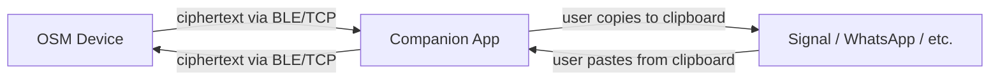

# Companion App (CA)

Desktop/Android companion app for the Offline Secure Messenger (OSM).
Acts as a **clipboard bridge** — receives encrypted ciphertext from the OSM
over BLE (or TCP in simulator mode) and displays it for the user to copy
into their messaging app. Incoming ciphertext from messaging apps is pasted
into the CA and sent to the OSM for decryption.

## Architecture



## Tech Stack

- **Kotlin Multiplatform** + **Compose Multiplatform**
- Desktop (JVM) + Android targets
- TCP transport for desktop simulator, BLE for Android (future)

## Building & Running (Desktop)

Requires JDK 11+.

```bash
cd companion-app

# Build
./gradlew :desktopApp:compileKotlinDesktop

# Run
./gradlew :desktopApp:run
```

Or use the locally-installed Gradle if the wrapper has SSL issues:
```bash
/tmp/gradle-8.10/bin/gradle :desktopApp:run --no-daemon
```

## Simulator Mode

The CA scans localhost ports 19200–19209 for running OSM instances.
Start one or more OSM simulators first:

```bash
cd osm/build
./secure_communicator --port 19200
./secure_communicator --port 19201  # second instance
```

Then launch the CA — it will auto-discover running OSMs.

## UI

| Panel | Purpose |
|---|---|
| **Device List** (left) | Discovered OSM devices with connection status, connect/disconnect buttons |
| **Device Detail** (right) | Received ciphertext with Copy buttons, send field with Paste + Send |

## Project Structure

```
companion-app/
├── build.gradle.kts          # Root Gradle config
├── settings.gradle.kts
├── gradle.properties
├── gradlew / gradlew.bat     # Gradle wrapper
├── shared/                   # Shared KMP module
│   └── src/
│       ├── commonMain/kotlin/com/osmapp/
│       │   ├── model/AppState.kt
│       │   ├── transport/Transport.kt
│       │   └── ui/CompanionAppUI.kt
│       └── desktopMain/kotlin/com/osmapp/
│           └── transport/TcpTransport.kt
└── desktopApp/               # Desktop entry point
    └── src/desktopMain/kotlin/Main.kt
```
