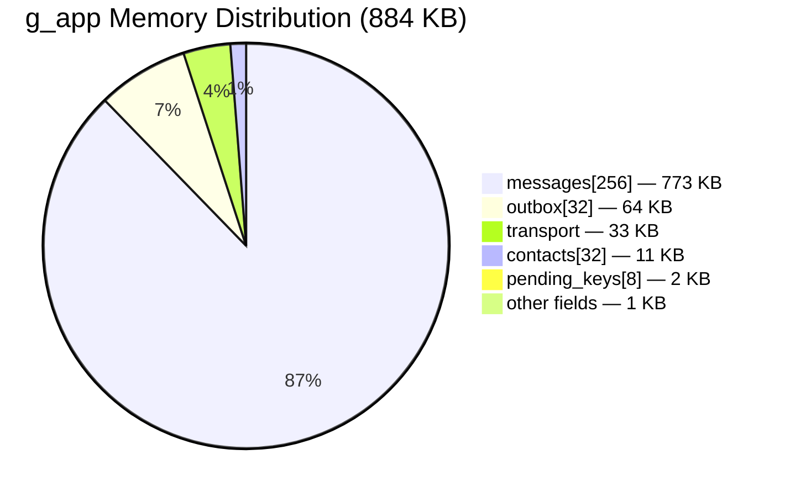
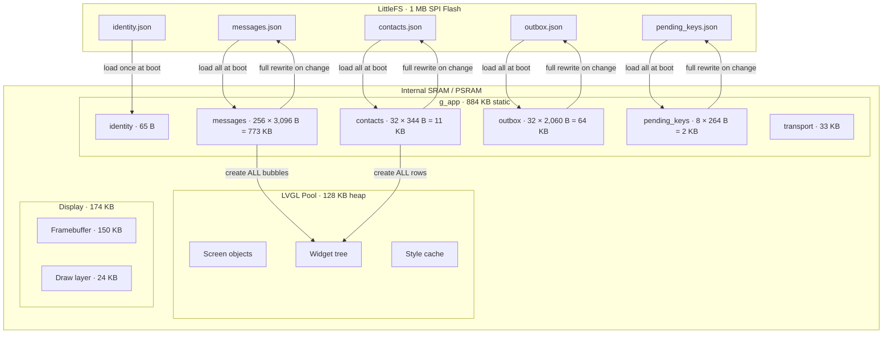
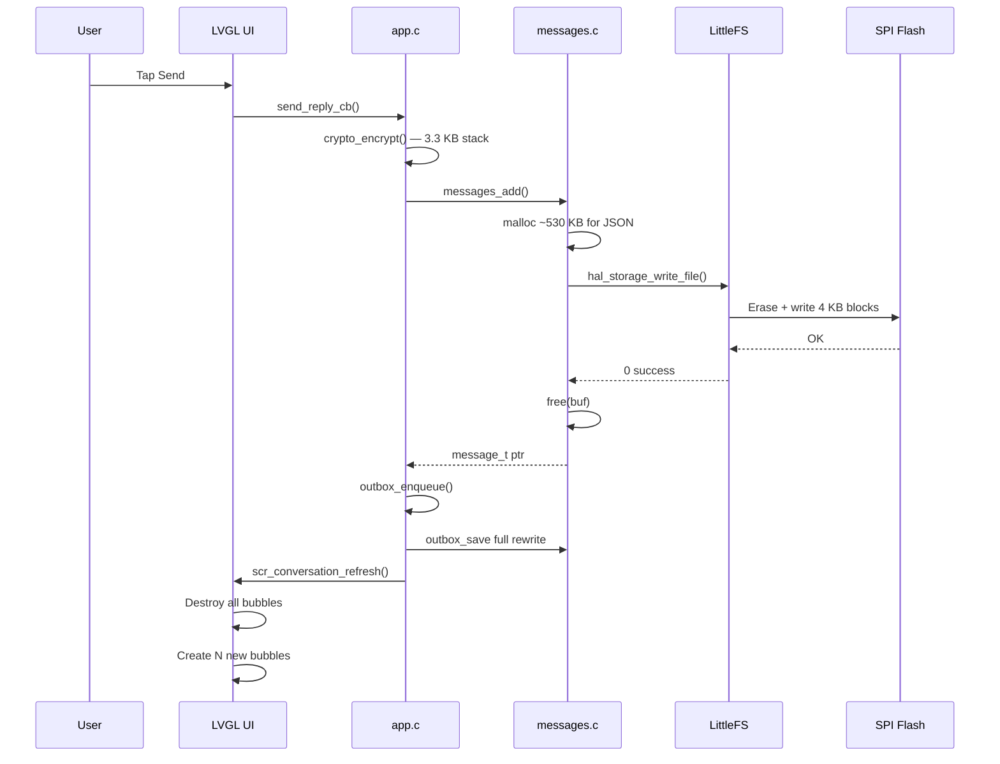
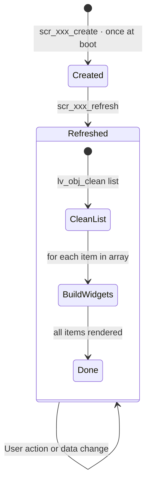
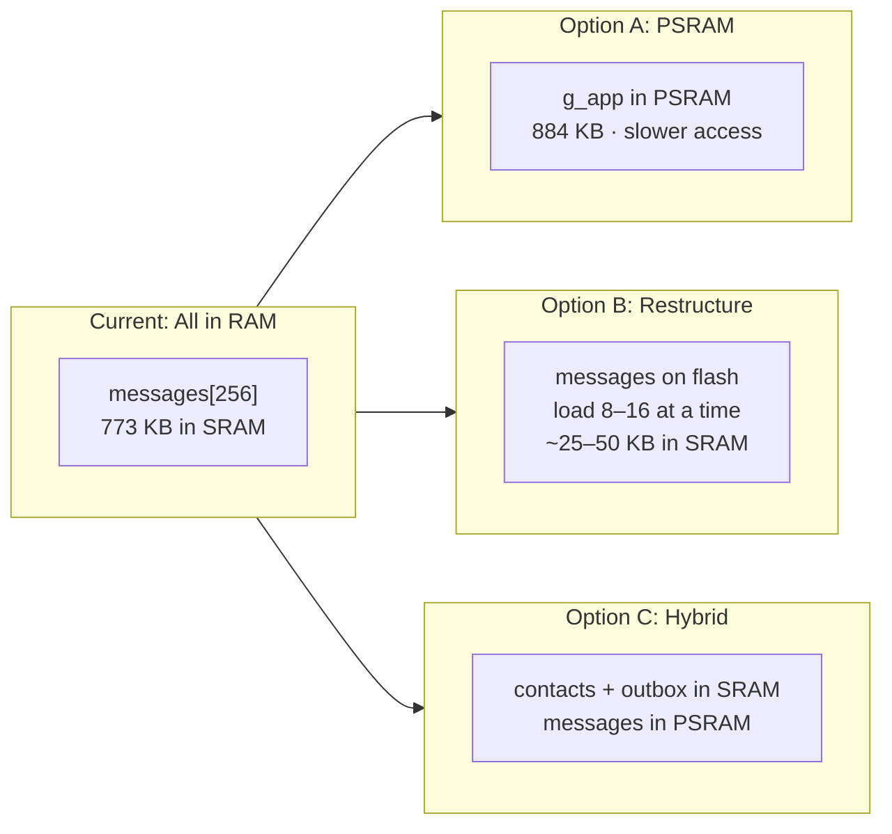

# OSM — System Design & Resource Analysis

> Detailed analysis of memory, storage, CPU, and rendering behavior for the
> Offline Secure Messenger firmware. Intended for hardware planning and
> MCU migration decisions.

## Table of Contents

- [1. Memory Map](#1-memory-map)
- [2. Data Structures](#2-data-structures)
- [3. Data Loading & Persistence](#3-data-loading--persistence)
- [4. Screen Rendering](#4-screen-rendering)
- [5. Cryptographic Operations](#5-cryptographic-operations)
- [6. Transport Layer](#6-transport-layer)
- [7. Flash Storage (LittleFS)](#7-flash-storage-littlefs)
- [8. LVGL Graphics Engine](#8-lvgl-graphics-engine)
- [9. CPU-Intensive Operations](#9-cpu-intensive-operations)
- [10. MCU Migration Concerns](#10-mcu-migration-concerns)
- [11. Optimization Roadmap](#11-optimization-roadmap)

---

## 1. Memory Map

### Total Static RAM Footprint

| Component | Size | Memory Type | Notes |
|-----------|------|-------------|-------|
| `g_app` (app_state_t) | **884 KB** | Static BSS | Single global instance |
| LVGL memory pool | **128 KB** | Heap (malloc) | `LV_MEM_SIZE` in lv_conf.h |
| LVGL draw layer buffer | **24 KB** | Heap | `LV_DRAW_LAYER_SIMPLE_BUF_SIZE` |
| SDL framebuffer | **150 KB** | Heap (SDL-managed) | 320×240×2 bytes RGB565 |
| LittleFS runtime | **~1 KB** | Stack/heap | Caches + lookahead buffer |
| Crypto per-operation | **~3.3 KB** | Stack (transient) | Freed after each encrypt/decrypt |
| **TOTAL** | **~1,190 KB** | | **~1.16 MB** |

### g_app Breakdown



The `messages[]` array dominates at **87%** of `g_app`. Each `message_t` is
3,096 bytes because it stores both plaintext (1,024 B) and ciphertext (2,048 B)
in-memory simultaneously.

### Data Flow: Flash ↔ RAM ↔ Display



---

## 2. Data Structures

### contact_t (344 bytes each, max 32)

| Field | Type | Size | Purpose |
|-------|------|------|---------|
| `id` | `uint32_t` | 4 B | Unique contact identifier |
| `name` | `char[64]` | 64 B | Display name (user-chosen, local only) |
| `status` | `contact_status_t` | 4 B | PENDING_SENT / PENDING_RECEIVED / ESTABLISHED |
| `public_key` | `char[256]` | 256 B | Peer's public key, base64-encoded |
| `unread_count` | `uint32_t` | 4 B | Unread message badge counter |
| `created_at` | `time_t` | 8 B | Contact creation timestamp |
| **padding** | | 4 B | Struct alignment |
| **Total** | | **344 B** | **× 32 = 11,008 B (10.8 KB)** |

### message_t (3,096 bytes each, max 256)

| Field | Type | Size | Purpose |
|-------|------|------|---------|
| `id` | `uint32_t` | 4 B | Unique message identifier |
| `contact_id` | `uint32_t` | 4 B | Owning contact's ID |
| `direction` | `msg_direction_t` | 4 B | MSG_SENT / MSG_RECEIVED |
| `plaintext` | `char[1024]` | 1,024 B | Decrypted message text |
| `ciphertext` | `char[2048]` | 2,048 B | Encrypted+base64 for outbox/transport |
| `timestamp` | `time_t` | 8 B | Message timestamp |
| **padding** | | 4 B | Struct alignment |
| **Total** | | **3,096 B** | **× 256 = 792,576 B (774 KB)** |

> ⚠️ **Key insight**: Each message stores both plaintext AND ciphertext in RAM.
> On MCU, ciphertext could be stored only on flash (read on demand for
> retransmission), saving ~512 KB.

### outbox_entry_t (2,060 bytes each, max 32)

| Field | Type | Size | Purpose |
|-------|------|------|---------|
| `data` | `char[2048]` | 2,048 B | Ciphertext payload to send |
| `char_uuid` | `uint16_t` | 2 B | BLE characteristic UUID |
| `msg_id` | `uint8_t[8]` | 8 B | SHA-512 prefix for ACK matching |
| `acked` | `bool` | 1 B | ACK received from peer |
| `sent` | `bool` | 1 B | Transmitted to CA at least once |
| **Total** | | **2,060 B** | **× 32 = 65,920 B (64 KB)** |

### pending_key_t (264 bytes each, max 8)

| Field | Type | Size | Purpose |
|-------|------|------|---------|
| `pubkey_b64` | `char[256]` | 256 B | Anonymous incoming public key |
| `received_at` | `time_t` | 8 B | Arrival timestamp |
| **Total** | | **264 B** | **× 8 = 2,112 B (2 KB)** |

### transport_t (33,072 bytes)

| Sub-component | Size | Purpose |
|---------------|------|---------|
| `clients[4]` | ~32 KB | 4 client slots, each with 4 KB RX reassembly buffer |
| Server socket/state | ~1 KB | Listen socket, connection tracking |

---

## 3. Data Loading & Persistence

### Loading Strategy: **Eager, All-at-Once**

All data is loaded into RAM during `app_init()` at boot:

```c
identity_load(&g_app.identity);     // Read identity.json → 65 bytes
contacts_load();                     // Read contacts.json → up to 11 KB
messages_load();                     // Read messages.json → up to 773 KB
app_pending_keys_load();             // Read pending_keys.json → up to 2 KB
app_outbox_load();                   // Read outbox.json → up to 64 KB
```

**There is no lazy loading or pagination.** Every contact and every message
exists in RAM for the entire lifetime of the application.

### Saving Strategy: **Full Rewrite**

Every save operation rewrites the entire JSON file from scratch:

| File | Trigger | Buffer | I/O Pattern |
|------|---------|--------|-------------|
| `contacts.json` | Contact add/rename/delete/status change | 8 KB stack | Full file rewrite |
| `messages.json` | Message send/receive/delete | **malloc(~530 KB)** for 256 msgs | Full file rewrite |
| `outbox.json` | Enqueue/dequeue/ACK | Stack buffer | Full file rewrite |
| `pending_keys.json` | Key receive/assign | Stack buffer | Full file rewrite |
| `identity.json` | Keygen (once) | Stack buffer | Single write |



> ⚠️ **messages_save() heap spike**: When 256 messages exist, `messages_save()`
> calls `malloc()` for a ~530 KB JSON buffer. This is a **transient spike** —
> the buffer is freed immediately after writing — but on a memory-constrained
> MCU this may fail. On MCU, a streaming write (serialize one message at a time
> directly to flash) would eliminate this allocation entirely.

### On-Disk Format

All files use **JSON text** format. Example `contacts.json`:

```json
[
  {"id":1, "name":"Alice", "status":2, "unread":0, "pubkey":"base64..."},
  {"id":2, "name":"Bob", "status":0, "unread":3, "pubkey":""}
]
```

Parsing uses `strstr()`-based scanning (no JSON library dependency). This is
lightweight on CPU but fragile — a binary format would be smaller, faster,
and more robust for MCU use.

---

## 4. Screen Rendering

### Rendering Strategy: **Destroy-and-Recreate All**

Every screen `_refresh()` function calls `lv_obj_clean()` on the list container,
destroying all child LVGL objects, then recreates them from scratch by iterating
the full in-memory arrays. **There is no virtual scrolling or lazy widget creation.**

#### Conversation Screen (scr_conversation.c)

For each message belonging to the selected contact:

```
1 × lv_obj (bubble container)    ~180 bytes LVGL overhead
1 × lv_label (direction "You"/"Them")  ~100 bytes
1 × lv_label (message text)      ~100 bytes + text length
```

**~380+ bytes of LVGL heap per message bubble.**

With 50 messages visible to one contact, that's ~19 KB of LVGL pool consumed
just for bubbles. With the 128 KB pool also serving the screen structure,
status bar, tab bar, reply bar, and confirmation dialogs, **practical limit
is roughly 80–100 messages per conversation** before LVGL runs out of memory.

#### Contacts Screen (scr_contacts.c)

For each contact:

```
1 × lv_obj (row container)       ~180 bytes
1 × lv_label (status icon)       ~100 bytes
1 × lv_label (name)              ~100 bytes
1-3 × lv_button (message/edit/delete) ~140 bytes each
1-3 × lv_label (button icons)    ~100 bytes each
```

**~700–1,000 bytes of LVGL heap per contact row** (established contacts have
more buttons than pending ones). With 32 contacts, that's ~24–32 KB of LVGL
pool — manageable but significant.

#### Inbox Screen (scr_inbox.c)

For each conversation entry:

```
1 × lv_obj (row)                 ~180 bytes
3-4 × lv_label (name, count, preview, badge)  ~100 bytes each
```

**~500–600 bytes per inbox row.** Sorts entries by timestamp using O(n²)
bubble sort on a stack-allocated array of `convo_entry_t[MAX_CONTACTS]`.

### Summary: LVGL Object Counts

| Screen | Objects per item | Max items | Peak LVGL usage |
|--------|-----------------|-----------|-----------------|
| Conversation | ~3 per message | 256 | ~97 KB (would exhaust pool) |
| Contacts | ~7 per contact | 32 | ~32 KB |
| Inbox | ~4 per entry | 32 | ~19 KB |
| Key Exchange | Fixed widgets | 1 | ~3 KB |
| Assign Key | ~3 per contact + fixed | 32 | ~15 KB |

---

## 5. Cryptographic Operations

### Algorithm: TweetNaCl (X25519 + XSalsa20-Poly1305)

| Operation | Stack Usage | CPU Cost | When |
|-----------|-------------|----------|------|
| `crypto_box()` encrypt | ~3.3 KB | ~1–2 ms (desktop), ~10–50 ms (ESP32) | Every message send |
| `crypto_box_open()` decrypt | ~3.3 KB | ~1–2 ms (desktop), ~10–50 ms (ESP32) | Every message receive |
| `crypto_box_keypair()` | ~128 B | ~2–5 ms (ESP32) | Once at setup |
| `crypto_scalarmult()` DH | ~512 B | ~10–30 ms (ESP32) | Once per key exchange |

### Stack Layout During Encrypt

```
┌─────────────────────────┐ ← Stack pointer
│ nonce[24]               │   24 bytes
│ m[CRYPTO_MAX_PADDED]    │   1,088 bytes (plaintext + NaCl padding)
│ c[CRYPTO_MAX_PADDED]    │   1,088 bytes (ciphertext output)
│ raw[CRYPTO_MAX_RAW]     │   1,112 bytes (nonce + ciphertext)
│ shared_key[32]          │   32 bytes
│ base64 output buffer    │   ~1,400 bytes
├─────────────────────────┤
│ Caller frame            │
└─────────────────────────┘

Total: ~3.3 KB transient stack usage per encrypt/decrypt call
```

All crypto buffers are **zeroed after use** (`memset(buf, 0, ...)`) for
security. The private key never leaves `g_app.identity` except during the
crypto operation itself.

---

## 6. Transport Layer

### Architecture

```
OSM (GATT Server / TCP Server)
  └── transport_t
       ├── server socket/handle
       └── clients[4]  (TRANSPORT_MAX_CLIENTS)
            ├── rx_buf[4096]   — reassembly buffer
            ├── tcp_buf[4096]  — TCP read buffer (desktop only)
            ├── rx_len, rx_expected_seq
            └── socket fd / BLE handle
```

### Fragmentation Protocol

Messages exceeding the MTU (200 bytes) are split into fragments:

| Byte | Field | Description |
|------|-------|-------------|
| 0 | `flags` | START (0x01), END (0x02), or both for single-fragment |
| 1-2 | `seq` | Fragment sequence number (little-endian u16) |
| 3+ | `payload` | Up to 197 bytes of message data |

**Buffer sizes**:

| Buffer | Size | Scope |
|--------|------|-------|
| RX reassembly per client | 4,096 B | Persistent while connected |
| TCP read buffer per client | 4,096 B | Desktop only |
| TX fragment (stack) | 200 B | Transient per `transport_send_message()` |
| Total per client | ~8 KB | Desktop; ~4 KB on BLE MCU |
| Total for 4 clients | ~33 KB | All transport buffers |

### Outbox Queue

Messages are **fire-and-forget with ACK tracking**:

1. `outbox_enqueue()` adds entry → persists to `outbox.json`
2. `outbox_flush()` sends all un-sent entries to connected CA(s)
3. CA delivers to recipient, recipient's OSM sends `ACK:<msg_id>`
4. ACK removes entry from outbox
5. If outbox full (32 entries), oldest entry is evicted

---

## 7. Flash Storage (LittleFS)

### Configuration

| Parameter | Value | Notes |
|-----------|-------|-------|
| **Total size** | 1 MB | 256 blocks × 4 KB |
| **Block size** | 4,096 B | Erase unit (matches SPI flash sector) |
| **Read/prog size** | 16 B | Minimum I/O granularity |
| **Cache size** | 256 B | Read + write cache |
| **Lookahead** | 16 B | Block allocation lookahead |
| **Wear leveling** | 500 cycles | Per-block cycle limit before relocation |

### File Sizes (Typical)

| File | Empty | 10 contacts, 50 messages | 32 contacts, 256 messages |
|------|-------|--------------------------|---------------------------|
| `identity.json` | ~120 B | ~120 B | ~120 B |
| `contacts.json` | ~4 B | ~4 KB | ~12 KB |
| `messages.json` | ~4 B | ~50 KB | ~260 KB |
| `outbox.json` | ~4 B | ~20 KB | ~66 KB |
| `pending_keys.json` | ~4 B | ~1 KB | ~2 KB |
| **Total** | ~136 B | ~75 KB | ~340 KB |

With 1 MB flash, even a full system (32 contacts, 256 messages, 32 outbox)
uses only ~34% of available storage. The remaining ~660 KB provides ample room
for wear leveling and future features (e.g., LVGL font assets).

### Write Amplification

Every save rewrites the entire file. For `messages.json` at capacity (256
messages, ~260 KB), that's **65 flash blocks erased and rewritten** per save.
At 500 wear cycles per block, a full-capacity message save could be performed
~500 × 256 / 65 ≈ **~1,969 times** before the blocks used by messages.json
reach their wear limit. LittleFS wear leveling distributes writes across all
256 blocks, extending effective lifetime proportionally.

---

## 8. LVGL Graphics Engine

### Configuration (lv_conf.h)

| Setting | Value | Impact |
|---------|-------|--------|
| `LV_MEM_SIZE` | 128 KB | Heap for all LVGL objects |
| `LV_DRAW_LAYER_SIMPLE_BUF_SIZE` | 24 KB | Intermediate render buffer |
| `LV_COLOR_DEPTH` | 16 | RGB565, 2 bytes/pixel |
| `LV_FONT_MONTSERRAT_10` | enabled | ~8 KB ROM |
| `LV_FONT_MONTSERRAT_12` | enabled (default) | ~10 KB ROM |
| `LV_FONT_MONTSERRAT_14` | enabled | ~12 KB ROM |
| `LV_FONT_MONTSERRAT_16` | enabled | ~14 KB ROM |
| `LV_FONT_DEFAULT` | Montserrat 12 | Used when no font specified |
| `LV_USE_DRAW_SW` | 1 | Software renderer |
| Draw unit count | 1 | Single-threaded |

### Object Lifecycle



Every `_refresh()` call **destroys and recreates** the entire list content.
This is simple but means:
- No widget reuse — every refresh allocates new LVGL objects
- LVGL's internal allocator fragments over time
- CPU spends cycles on object creation/destruction each refresh

### Font Storage

Fonts are compiled into the firmware binary (internal flash / code space):

| Font | Approx. ROM Size | Used By |
|------|-------------------|---------|
| Montserrat 10 | ~8 KB | Badges, small labels, button icons |
| Montserrat 12 | ~10 KB | Default body text, message bubbles |
| Montserrat 14 | ~12 KB | Screen titles, contact names |
| Montserrat 16 | ~14 KB | Setup screen heading |
| **Total** | **~44 KB** | In firmware .rodata section |

On MCU, these could optionally be stored on external SPI flash behind LittleFS
and loaded on demand, freeing ~44 KB of internal flash for code.

---

## 9. CPU-Intensive Operations

### Ranked by Cost (ESP32-S3 @ 240 MHz, estimated)

| Operation | Duration | Frequency | Blocking? |
|-----------|----------|-----------|-----------|
| **crypto_box (encrypt)** | 10–50 ms | Per message send | Yes — UI freezes |
| **crypto_box_open (decrypt)** | 10–50 ms | Per message receive | Yes — UI freezes |
| **messages_save (256 msgs)** | 50–200 ms | Per send/receive/delete | Yes — flash write |
| **scr_conversation_refresh (100 msgs)** | 5–20 ms | Per screen open/send | Yes — LVGL rebuild |
| **crypto_scalarmult (DH)** | 10–30 ms | Per key exchange | Yes |
| **contacts_save** | 1–5 ms | Per contact change | Yes |
| **lv_timer_handler** | 1–5 ms | Every 33 ms (30 FPS) | Cooperative |
| **Fragment TX** | <1 ms | Per 200-byte chunk | No (non-blocking) |

### Potential UI Stalls

The **single-threaded cooperative model** means any blocking operation freezes
the display. The worst case is sending a message at capacity:

```
encrypt()          → 10–50 ms
messages_save()    → 50–200 ms
outbox_save()      → 10–50 ms
conversation_refresh() → 5–20 ms
─────────────────────────
Total:               75–320 ms  (noticeable stutter)
```

On desktop (x86) this is sub-millisecond. On ESP32-S3 it becomes perceptible.

---

## 10. MCU Migration Concerns

### Target: LILYGO T-Deck (ESP32-S3)

| Resource | Available | Current Usage | Status |
|----------|-----------|---------------|--------|
| **Internal SRAM** | 320 KB | 884 KB (g_app alone) | ❌ **3× over budget** |
| **PSRAM** | 8 MB (optional) | 884 KB + 128 KB LVGL | ✅ Fits in PSRAM |
| **Internal Flash** | 16 MB | ~300 KB firmware + 44 KB fonts | ✅ Ample |
| **SPI Flash** | 16 MB (shared) | 1 MB LittleFS | ✅ Ample |
| **Stack** | 8 KB (default task) | 3.3 KB per crypto op | ⚠️ Tight |

### Critical Issue: g_app Cannot Fit in Internal SRAM

The `app_state_t` structure at **884 KB** is nearly 3× the ESP32-S3's usable
SRAM (~320 KB). This is entirely due to the `messages[256]` array at 773 KB.

**Required mitigations:**



| Approach | RAM Saving | Complexity | Latency Impact |
|----------|-----------|------------|----------------|
| **A: All in PSRAM** | None (moves to slower RAM) | Low | ~2× slower access |
| **B: Paginated flash reads** | ~750 KB | High | Flash read per page scroll |
| **C: Hybrid** | ~750 KB from SRAM | Medium | Messages via PSRAM cache |
| **D: Drop ciphertext from RAM** | ~512 KB | Low | Re-read from flash for retransmit |

**Option D** (drop `ciphertext` field from in-memory `message_t`) is the
lowest-effort change — the ciphertext is only needed for outbox retransmission,
which already has its own copy in `outbox_entry_t`. This alone reduces
`message_t` from 3,096 to 1,048 bytes, and the messages array from 773 KB to
**262 KB**.

### messages_save() Heap Spike

At 256 messages, `messages_save()` calls `malloc()` for a **~530 KB** JSON
serialization buffer. On MCU, this allocation will fail unless PSRAM is
available. The fix is a **streaming serializer** that writes one message at a
time directly to the LittleFS file handle, requiring only ~3 KB of stack.

### Stack Depth

The ESP32-S3 default task stack is 8 KB. The crypto operations alone consume
3.3 KB. Combined with LVGL's refresh call chain (~1–2 KB), LittleFS file
operations (~512 B), and normal call overhead, the stack is at ~5–6 KB peak.
This leaves only ~2 KB margin. **Recommend increasing to 16 KB task stack.**

---

## 11. Optimization Roadmap

### Phase 1: Low-Effort (Desktop-Compatible)

| Change | RAM Saved | Effort |
|--------|-----------|--------|
| Remove `ciphertext[2048]` from `message_t` | **512 KB** | Low |
| Reduce `MAX_MESSAGES` from 256 to 64 | **594 KB** | Trivial |
| Reduce `MAX_TEXT_LEN` from 1024 to 512 | **~96 KB** | Low |
| Reduce `MAX_CIPHER_LEN` from 2048 to 1024 | **~32 KB outbox** | Low |

Removing ciphertext alone gets `g_app` from 884 KB to **~372 KB**, which
fits in PSRAM easily and is close to internal SRAM (with further reductions).

### Phase 2: MCU-Specific

| Change | Benefit | Effort |
|--------|---------|--------|
| Streaming JSON serializer | Eliminates 530 KB heap spike | Medium |
| Binary format (CBOR/msgpack or custom) | Faster parse, smaller files | Medium |
| Paginated message loading (8–16 at a time) | Only ~25–50 KB for messages | High |
| LVGL virtual scrolling for conversation | Constant LVGL memory per screen | High |
| Move fonts to SPI flash (LittleFS) | Saves 44 KB internal flash | Medium |
| Async crypto (FreeRTOS task) | Eliminates UI stall on encrypt | Medium |

### Phase 3: Production Hardening

| Change | Benefit |
|--------|---------|
| Wear-leveled append-only message log | Eliminates full-file rewrite |
| Index file for message pagination | O(1) message lookup |
| LVGL fragment pool / object recycling | Reduces allocator fragmentation |
| DMA-based SPI flash reads | CPU free during flash I/O |
| Hardware crypto acceleration (ESP32 AES) | 10× faster encrypt (but NaCl uses ChaCha) |

---

## Appendix: Exact Struct Sizes (x86-64, GCC)

Measured via `sizeof()` on the build host. ARM Cortex-M sizes may differ
slightly due to alignment rules but will be within a few bytes.

```
sizeof(contact_t)        =    344 bytes
sizeof(message_t)        =  3,096 bytes
sizeof(outbox_entry_t)   =  2,060 bytes
sizeof(pending_key_t)    =    264 bytes
sizeof(crypto_identity_t)=     65 bytes
sizeof(transport_t)      = 33,072 bytes
sizeof(app_state_t)      = 904,928 bytes  (884 KB)
```
