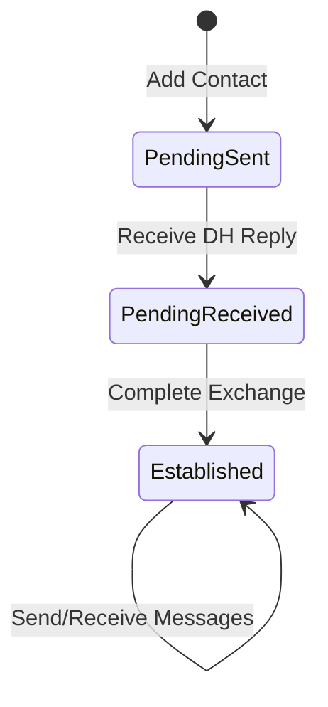

# OSM — Offline Secure Messenger

Desktop simulator for the OSM hardware device. Built with **C + LVGL 9.4 + SDL2**.
The 320×240 device display is rendered at 2× zoom (640×480) for comfortable
desktop interaction.

## Screens

| Screen | Purpose |
|---|---|
| **Setup** | First-launch keypair generation wizard (gates all other screens) |
| **Home** | Dashboard with contact list, status icons, unread badges, CA indicator |
| **Contacts** | Add/view/delete contacts, tap to start key exchange |
| **Key Exchange** | 3-step Diffie-Hellman wizard (send → receive → establish) |
| **Compose** | Pick an established contact, type a message, encrypt and send |
| **Inbox** | Conversation list sorted by most-recent message |
| **Conversation** | Chat bubbles with inline reply, delete messages or thread |

### Contact Lifecycle



### Contact & Message Management

- **Delete contact**: Red trash button per row, confirmation dialog warns about
  message removal.
- **Delete thread**: Trash button in conversation header clears all messages,
  preserves contact.
- **Delete message**: Tap any bubble for a single-message delete prompt.

## Encryption

Uses **TweetNaCl** (X25519 + XSalsa20-Poly1305):
- Keypair generated on first launch and persisted to `data_identity.json`
- Messages encrypted with `crypto_box()`, nonce prepended, base64-encoded
- Decryption with `crypto_box_open()` — authentication failure rejects message

## Transport Layer

The OSM communicates with the **Companion App (CA)** over a TCP transport
(simulating BLE GATT in desktop mode).

- OSM listens on TCP port (default: 19200, configurable via `--port`)
- Fragmentation protocol: `[flags][seq][payload]` with START/END markers
- Outbound message queue: ciphertext queued when no CA connected, flushed on connect
- Home screen shows CA connection status indicator

### Message Envelope Protocol

All messages between OSM and CA use a text-based envelope:

| Prefix | Format | Purpose |
|---|---|---|
| `OSM:KEY:` | `OSM:KEY:<sender_name>:<pubkey_b64>` | Key exchange (auto-creates contact on receiver) |
| `OSM:MSG:` | `OSM:MSG:<ciphertext_b64>` | Encrypted message |

**Key exchange flow:**
1. Alice adds "Bob" → OSM sends `OSM:KEY:Alice:<alice_pubkey>` to CA
2. Bob receives via his CA → OSM auto-creates contact "Alice" (PENDING_RECEIVED)
3. Bob completes exchange → OSM sends `OSM:KEY:Bob:<bob_pubkey>`
4. Alice receives → contact "Bob" transitions from PENDING_SENT to ESTABLISHED

## Building

```bash
cd osm
mkdir -p build && cd build
cmake ..
make -j$(nproc)
```

### Incremental rebuild

```bash
cd osm/build && make -j$(nproc)
```

### Clean rebuild

```bash
rm -rf osm/build && mkdir osm/build && cd osm/build && cmake .. && make -j$(nproc)
```

## Running

### Interactive mode

```bash
cd osm/build
./secure_communicator                           # default port 19200
./secure_communicator --port 19201              # custom port
./secure_communicator --port 19200 --name Alice # named instance
```

`--name` sets the device identity displayed in the header bar and used in
the `OSM:KEY:<name>:<pubkey>` envelope during key exchange.

One SDL window opens at 640×480 (320×240 at 2× zoom). Use mouse and keyboard.
Click textareas to focus before typing.

### Self-test mode

```bash
cd osm/build
./secure_communicator --test
```

Runs 69 automated tests covering screens, navigation, input, CRUD, deletion,
encryption, and transport. Screenshots saved to `osm/screenshots/`. Exits 0 on success.

### Smoke test

```bash
cd osm/build
python3 ../tests/smoke_test.py
```

## Project Structure

```
osm/
├── CMakeLists.txt
├── lv_conf.h               # LVGL compile-time settings
├── lvgl/                   # LVGL 9.4.0 (git submodule)
├── src/
│   ├── main.c              # Entry point, SDL window + input setup
│   ├── app.h               # Types, constants, app state
│   ├── app.c               # App lifecycle, navigation, test driver
│   ├── crypto.h/c          # TweetNaCl encryption wrapper
│   ├── tweetnacl.h/c       # TweetNaCl library (vendored)
│   ├── transport/
│   │   ├── transport.h     # Abstract transport interface
│   │   └── transport_tcp.c # TCP server (desktop simulator)
│   ├── data/
│   │   ├── contacts.h/c    # Contact CRUD + JSON persistence
│   │   ├── messages.h/c    # Message CRUD + JSON persistence
│   │   └── identity.h/c    # Keypair persistence
│   └── screens/
│       ├── scr_setup.h/c
│       ├── scr_home.h/c
│       ├── scr_contacts.h/c
│       ├── scr_key_exchange.h/c
│       ├── scr_compose.h/c
│       ├── scr_inbox.h/c
│       └── scr_conversation.h/c
└── tests/
    └── smoke_test.py
```

## Technical Decisions

- **Manual input group management**: `lv_group_set_default()` is avoided.
  Textareas are explicitly added to `dev_group` via `lv_group_add_obj()`.
- **Display–indev binding**: `lv_indev_create()` binds to whichever display is
  default at creation time.
- **C11, no external deps beyond SDL2**: Keeps the path to ESP32 deployment
  short. JSON persistence is hand-rolled.
- **Dark theme**: bg `#1A1A2E`, header `#16213E`, primary `#00B0FF`,
  green `#00E676`, red `#FF1744`.

## Configuration

Key `lv_conf.h` values:

| Setting | Value | Purpose |
|---|---|---|
| `LV_COLOR_DEPTH` | 16 | Match embedded LCD panels |
| `LV_MEM_SIZE` | 128 KB | LVGL memory pool |
| `LV_FONT_MONTSERRAT_*` | 10, 12, 14, 16 | Available font sizes |
| `LV_FONT_DEFAULT` | Montserrat 12 | Default UI font |
| `LV_USE_SDL` | 1 | SDL2 display/input drivers |
| `LV_SDL_DIRECT_EXIT` | 1 | `exit(0)` on SDL window close |
