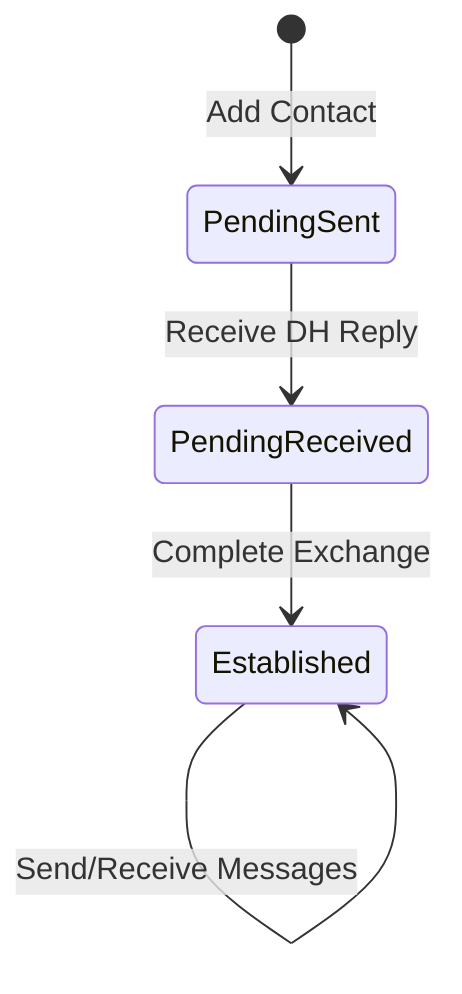

# OSM — Offline Secure Messenger

Desktop simulator for the OSM hardware device. Built with **C + LVGL 9.4 + SDL2**.
The 320×240 device display is rendered at 2× zoom (640×480) for comfortable
desktop interaction.

## Screens

| Screen | Purpose |
|---|---|
| **Setup** | First-launch keypair generation wizard (gates all other screens) |
| **Contacts** | Add/view/rename/delete contacts; message button for established contacts. Bottom tab bar. |
| **Key Exchange** | 3-step Diffie-Hellman wizard (send → receive → establish) |
| **Assign Key** | Assign incoming anonymous public keys to contacts |
| **Inbox** | Conversation list sorted by most-recent message. Bottom tab bar. |
| **Conversation** | Full-screen chat with inline reply bar, delete messages or thread |

All screens share a **status bar** (20px top) showing device name, pending-key
badge, and CA connection status. Contacts and Inbox have a **tab bar** (32px
bottom) for switching between them. Conversation is full-screen with a back
button returning to the originating tab.

### Contact Lifecycle



### Contact & Message Management

- **Delete contact**: Red trash button per row, confirmation dialog warns about
  message removal.
- **Delete thread**: Trash button in conversation header clears all messages,
  preserves contact.
- **Delete message**: Tap any bubble for a single-message delete prompt.

## Encryption

Uses **TweetNaCl** (X25519 + XSalsa20-Poly1305):
- Keypair generated on first launch and persisted to LittleFS
- Messages encrypted with `crypto_box()`, nonce prepended, base64-encoded
- Decryption with `crypto_box_open()` — authentication failure rejects message

## Persistent Storage

All data is stored in a **LittleFS** filesystem image (`osm_data.img`):

| File | Contents |
|---|---|
| `identity.json` | Public/private keypair |
| `contacts.json` | Contact list with pubkeys and status |
| `messages.json` | Message history |
| `outbox.json` | Queued outbound ciphertext (delivered on CA connect) |
| `pending_keys.json` | Incoming anonymous keys awaiting assignment |

```bash
# Clear all persistent data and start fresh
rm osm_data.img
```

On first run, the image is auto-created (1 MB, auto-formatted).
On the MCU target, LittleFS maps directly to SPI flash.

## Transport Layer

The OSM communicates with the **Companion App (CA)** over a TCP transport
(simulating BLE GATT in desktop mode).

- OSM listens on TCP port (default: 19200, configurable via `--port`)
- Fragmentation protocol: `[flags][seq][payload]` with START/END markers
- Outbound message queue: ciphertext queued when no CA connected, flushed on connect
- Status bar shows CA connection status indicator on all screens

### Message Envelope Protocol

All messages between OSM and CA use a text-based envelope:

| Prefix | Format | Purpose |
|---|---|---|
| `OSM:KEY:` | `OSM:KEY:<pubkey_b64>` | Key exchange (anonymous — queued for user assignment) |
| `OSM:MSG:` | `OSM:MSG:<ciphertext_b64>` | Encrypted message |

**Key exchange flow:**
1. Alice adds "Bob" → OSM sends `OSM:KEY:<alice_pubkey>` to CA (no sender name)
2. Bob receives via his CA → OSM queues pubkey in **pending keys** queue
3. Bob opens "Assign Key" screen → assigns key to new contact "Alice" (PENDING_RECEIVED)
4. Bob completes exchange → OSM sends `OSM:KEY:<bob_pubkey>`
5. Alice receives → "Assign Key" → selects "Bob (Pending Sent)" → ESTABLISHED

Incoming keys are stored in a pending queue (max 8). The status bar shows an
orange badge when keys await assignment. Contact names are entirely local — the
protocol carries no identity information.

## Building

```bash
cd osm
mkdir -p build && cd build
cmake ..
make -j$(nproc)
```

### Incremental rebuild

```bash
cd osm/build && make -j$(nproc)
```

### Clean rebuild

```bash
rm -rf osm/build && mkdir osm/build && cd osm/build && cmake .. && make -j$(nproc)
```

## Running

### Interactive mode

```bash
cd osm/build
./secure_communicator                           # default port 19200
./secure_communicator --port 19201              # custom port
./secure_communicator --port 19200 --name Alice # named instance
```

`--name` sets the device identity displayed in the header bar.

One SDL window opens at 640×480 (320×240 at 2× zoom). Use mouse and keyboard.
Click textareas to focus before typing.

### Self-test mode

```bash
cd osm/build
./secure_communicator --test
```

Runs 69 automated tests covering screens, navigation, input, CRUD, deletion,
encryption, and transport. Screenshots saved to `osm/screenshots/`. Exits 0 on
success. Additionally, 51 E2E integration tests run via Python.

### Smoke test

```bash
cd osm/build
python3 ../tests/smoke_test.py
```

## Project Structure

```
osm/
├── CMakeLists.txt
├── lv_conf.h               # LVGL compile-time settings
├── lvgl/                   # LVGL 9.4.0 (git submodule)
├── littlefs/               # LittleFS filesystem (vendored)
│   └── bd/                 # Block device backends (filebd, rambd)
├── src/
│   ├── main.c              # Entry point, SDL window + input setup
│   ├── app.h               # Types, constants, app state
│   ├── app.c               # App lifecycle, navigation, test driver
│   ├── crypto.h/c          # TweetNaCl encryption wrapper
│   ├── tweetnacl.h/c       # TweetNaCl library (vendored)
│   ├── hal/                # Platform Abstraction Layer
│   │   ├── hal_storage.h   # LittleFS init/mount/get API
│   │   ├── hal_storage_filebd.c  # Desktop: file-backed block device
│   │   ├── hal_storage_util.h    # Read/write file helpers
│   │   ├── hal_rng.h       # Random bytes API
│   │   ├── hal_rng_posix.c # Desktop: /dev/urandom
│   │   ├── hal_log.h       # Logging API
│   │   └── hal_log_posix.c # Desktop: fprintf(stderr)
│   ├── transport/
│   │   ├── transport.h     # Abstract transport interface
│   │   ├── transport_common.c  # Fragmentation, reassembly, ACK
│   │   ├── transport_tcp.c # TCP server (desktop simulator)
│   │   └── transport_ble.c # BLE GATT server (BlueZ)
│   ├── data/
│   │   ├── contacts.h/c    # Contact CRUD + LittleFS persistence
│   │   ├── messages.h/c    # Message CRUD + LittleFS persistence
│   │   └── identity.h/c    # Keypair persistence
│   └── screens/
│       ├── ui_common.h/c       # Shared status bar + tab bar
│       ├── scr_setup.h/c
│       ├── scr_contacts.h/c
│       ├── scr_key_exchange.h/c
│       ├── scr_assign_key.h/c
│       ├── scr_inbox.h/c
│       └── scr_conversation.h/c
└── tests/
    └── smoke_test.py
```

## Technical Decisions

- **LittleFS for persistence**: Unified storage layer that works on desktop
  (file-backed) and MCU (SPI flash). Replaces loose JSON files.
- **HAL abstraction**: `hal_storage`, `hal_rng`, `hal_log` keep platform-specific
  code isolated. Desktop-only code guarded by `#ifndef OSM_MCU_BUILD`.
- **Manual input group management**: `lv_group_set_default()` is avoided.
  Textareas are explicitly added to `dev_group` via `lv_group_add_obj()`.
- **Display–indev binding**: `lv_indev_create()` binds to whichever display is
  default at creation time.
- **C11, minimal deps**: SDL2 (desktop only) + LVGL + TweetNaCl + LittleFS.
  Keeps the path to ESP32 deployment short.
- **Dark theme**: bg `#1A1A2E`, header `#16213E`, primary `#00B0FF`,
  green `#00E676`, red `#FF1744`.

## Configuration

Key `lv_conf.h` values:

| Setting | Value | Purpose |
|---|---|---|
| `LV_COLOR_DEPTH` | 16 | Match embedded LCD panels |
| `LV_MEM_SIZE` | 128 KB | LVGL memory pool |
| `LV_FONT_MONTSERRAT_*` | 10, 12, 14, 16 | Available font sizes |
| `LV_FONT_DEFAULT` | Montserrat 12 | Default UI font |
| `LV_USE_SDL` | 1 | SDL2 display/input drivers |
| `LV_SDL_DIRECT_EXIT` | 1 | `exit(0)` on SDL window close |
